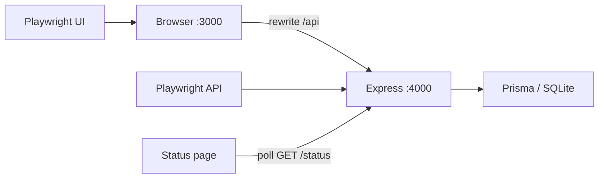
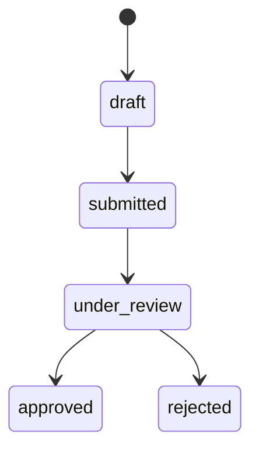

# Architecture

LoanFlow is a test target. The suite is the product.

## App (`loanflow/`)

- **web** — Next.js App Router, Tailwind. Token in `localStorage` (`loanflow_token`). `/api/*` is rewritten to Express so the browser is same-origin.
- **api** — Express + JWT. Seven endpoints, multipart uploads, state-machine `PUT /status`.
- **db** — SQLite via Prisma. Tables: `users`, `applications`, `documents`.

### Pages

| Route | Role |
|---|---|
| `/login` | JWT login |
| `/apply` | Create `draft` |
| `/apply/[id]/documents` | PDF/JPG upload, then submit |
| `/applications/[id]` | Poll status every 2s |
| `/dashboard` | Auth-gated list + status filter |

### API

| Method | Path |
|---|---|
| POST | `/api/auth/login` |
| POST | `/api/applications` |
| GET | `/api/applications` |
| GET | `/api/applications/:id` |
| POST | `/api/applications/:id/documents` |
| PUT | `/api/applications/:id/status` |
| GET | `/api/applications/:id/status` |

### State machine

Illegal transitions return **409**. Validation errors return **400**. Missing/expired JWT **401**. Other user's resource **403**.

`GET /status` may advance `submitted → under_review` after a random 1–5s delay, then `under_review → approved|rejected` one second later (`loanAmount <= annualIncome * 4` → approved). That delay is the suite's flakiness surface.

## Suite (`loanflow-qa/`)

- `pages/` — Page Object Model. Specs never call `page.locator()`.
- `tests/ui/` and `tests/api/` — never mixed.
- `fixtures/application-factory.ts` — all payloads.
- `schemas/` — zod. Every API assertion parses the body.
- `utils/wait-helpers.ts` — timeout + backoff for async status.
- `utils/api-client.ts` — Playwright `APIRequestContext` against `:4000`.
